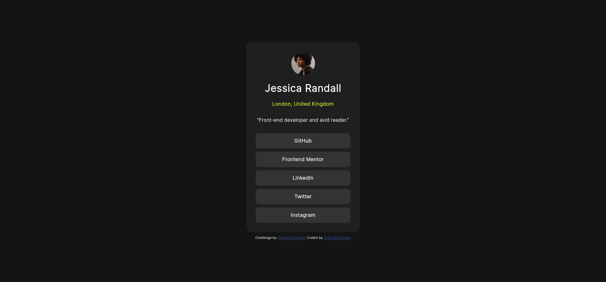
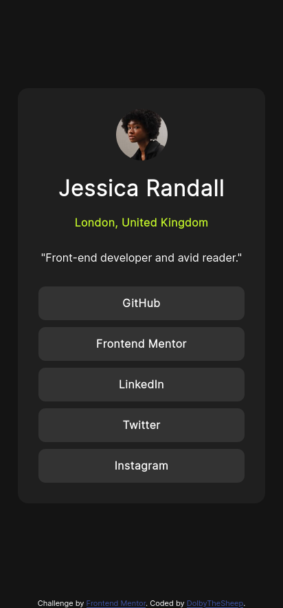

# Frontend Mentor - Social links profile solution

This is a solution to the [Social links profile challenge on Frontend Mentor](https://www.frontendmentor.io/challenges/social-links-profile-UG32l9m6dQ). Frontend Mentor challenges help you improve your coding skills by building realistic projects. 

## Table of contents

- [Overview](#overview)
  - [The challenge](#the-challenge)
  - [Screenshot](#screenshot)
  - [Links](#links)
- [My process](#my-process)
  - [Built with](#built-with)
  - [What I learned](#what-i-learned)

## Overview

### The challenge

Users should be able to:

- See hover and focus states for all interactive elements on the page

### Screenshot

| Desktop                                          |                                                |
|--------------------------------------------------|------------------------------------------------|
|||

### Links

- Solution URL: [github.com/DolbyTheSheep/Social-Links-Profile.git](https://github.com/DolbyTheSheep/Social-Links-Profile.git)
- Live Site URL: [dolbythesheep.github.io/Social-Links-Profile/](https://dolbythesheep.github.io/Social-Links-Profile/)

## My process

### Built with

- Semantic HTML5 markup
- CSS custom properties
- Flexbox

### What I learned

Adding an hover effect and styling lists elements.

```css
li:hover {
    background-color: hsl(75, 94%, 57%);
    color: hsl(0, 0%, 20%);
    cursor: pointer;
}
```